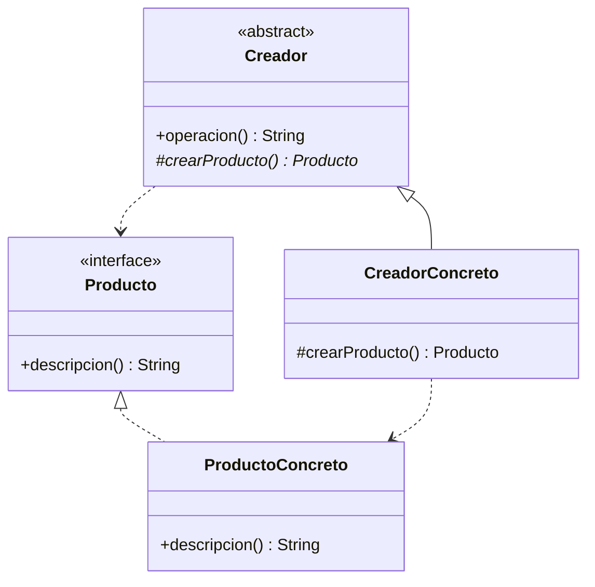

# Paso 1 — Método fábrica

¡Hola! 👋 Bienvenido al paso 1.

El patrón **Método fábrica** delega la creación de objetos a una jerarquía de creadores. En lugar de instanciar clases concretas directamente con `new` o con constructores dispersos, defines una operación de creación que las subclases pueden especializar.

Esto reduce el acoplamiento entre quien usa el objeto y la clase concreta que lo implementa. Es útil cuando quieres que el código cliente trabaje contra una abstracción y que la decisión de qué producto crear quede encapsulada.

En Kotlin suele modelarse con una interfaz de producto y una clase base abstracta que define el flujo general, pero deja pendiente el método de creación.

## Diagrama UML / estructura sugerida

```text
Creador abstracto
  ├─ create(): Producto
  └─ operacion() usa Producto
 ▲
 │
CreadorConcreto ───────► ProductoConcreto

Cliente ──► Creador abstracto ──► Producto
```



## El esqueleto actual 🧩

Abre el archivo `src/main/kotlin/patterns/creational/FactoryMethod.kt`. Encontrarás algo parecido a esto:

```kotlin
package patterns.creational

interface ProductoPendienteFactoryMethod {
    fun descripcion(): String
}

abstract class TallerPendiente {
    fun prepararPedido(): String {
        val producto = crearProductoPendiente()
        return "Pedido preparado para ${producto.descripcion()}"
    }

    protected open fun crearProductoPendiente(): ProductoPendienteFactoryMethod {
        // TODO: reemplaza este método por un verdadero método fábrica abstracto.
        return object : ProductoPendienteFactoryMethod {
            override fun descripcion(): String = "producto temporal"
        }
    }
}

class FactoryMethodDemo {
    fun ejecutar(): String {
        // TODO: crea un creador concreto y úsalo desde aquí.
        return TallerLocal().prepararPedido()
    }
}

class TallerLocal : TallerPendiente()
```

## Tu tarea ✅

1. Define una interfaz `Product` (o `Producto`) con al menos una operación que describa el resultado.
2. Convierte la clase creadora en una clase abstracta con un método fábrica como `abstract fun create()` o `abstract fun crearProducto()`.
3. Crea al menos un creador concreto y un producto concreto que permitan ejecutar el flujo completo.
4. Actualiza el ejemplo final para demostrar que la creación queda encapsulada en el creador concreto.

Luego haz commit y push a `main`:

```bash
git add .
git commit -m "paso-1: implemento metodo fabrica"
git push
```

<details>
<summary>💡 Pista</summary>

Piensa primero en **qué sabe hacer el producto** y luego en **quién decide cuál producto concreto construir**. El cliente no debería depender de `ProductoDigital`, `ProductoFisico` o nombres similares.

</details>
