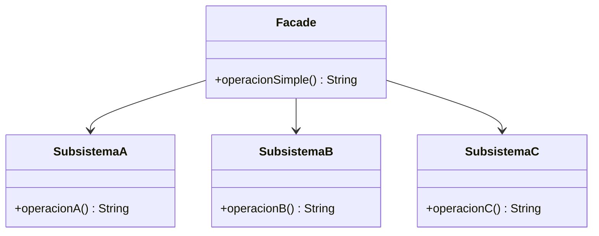

# Paso 10 — Fachada

¡Hola! 👋 Bienvenido al paso 10.

El patrón **Facade** ofrece una interfaz simple para un subsistema complejo. Su objetivo no es ocultar toda la complejidad, sino concentrar los casos de uso frecuentes en un punto fácil de consumir.

Esto mejora la legibilidad del cliente y reduce el acoplamiento con múltiples clases internas. Si luego cambian detalles del subsistema, la mayoría del código cliente puede permanecer intacta.

En Kotlin, una fachada suele ser una clase pequeña que orquesta varias colaboraciones y expone métodos de alto nivel.

## Diagrama UML / estructura sugerida

```text
Cliente ──► Facade ──► Subsistema A
          ├─► Subsistema B
          └─► Subsistema C
```



## El esqueleto actual 🧩

Abre el archivo `src/main/kotlin/patterns/structural/Facade.kt`. Encontrarás algo parecido a esto:

```kotlin
package patterns.structural

class Inventario {
    fun reservar(sku: String): String = "Inventario reservado para $sku"
}

class Pagos {
    fun cobrar(total: Double): String = "Cobro realizado por $total"
}

class Envio {
    fun programar(direccion: String): String = "Envío programado a $direccion"
}

class CheckoutManualPendiente(
    private val inventario: Inventario,
    private val pagos: Pagos,
    private val envio: Envio
) {
    fun completarPedido(sku: String, total: Double, direccion: String): List<String> {
        // TODO: crea una fachada que simplifique esta orquestación.
        return listOf(
            inventario.reservar(sku),
            pagos.cobrar(total),
            envio.programar(direccion)
        )
    }
}
```

## Tu tarea ✅

1. Crea una clase `Facade` o `Fachada` que encapsule varios servicios del subsistema.
2. Expón una operación de alto nivel con un nombre claro para el caso de uso principal.
3. Haz que el cliente dependa de la fachada en lugar de coordinar manualmente cada paso.
4. Deja visible en el ejemplo que la fachada simplifica varias llamadas internas.

Luego haz commit y push a `main`:

```bash
git add .
git commit -m "paso-10: implemento fachada"
git push
```

<details>
<summary>💡 Pista</summary>

Una buena fachada no reemplaza toda la API interna; solo crea un **camino feliz** para los escenarios más comunes.

</details>
