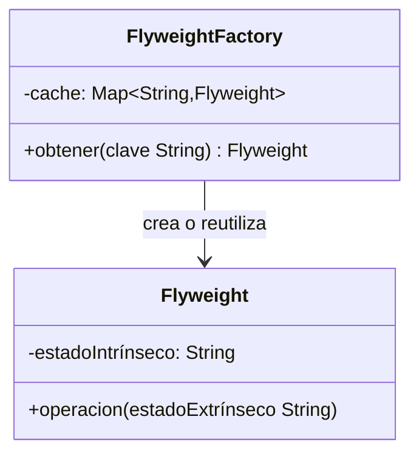

# Paso 11 — Peso mosca

¡Hola! 👋 Bienvenido al paso 11.

El patrón **Flyweight** comparte estado inmutable entre muchos objetos finos para reducir consumo de memoria. Separa el estado intrínseco (compartible) del extrínseco (dependiente del contexto).

Es útil cuando tienes miles de instancias similares: caracteres en un editor, árboles en un mapa, íconos, partículas. En vez de repetir datos idénticos, reutilizas una misma instancia compartida.

La pieza clave suele ser una fábrica que cachea flyweights y devuelve la misma instancia cuando recibe la misma clave.

## Diagrama UML / estructura sugerida

```text
Cliente ──► FlyweightFactory ──► cache[clave] = Flyweight
                      └─ si existe, reutiliza

estado intrínseco compartido + estado extrínseco enviado por el cliente
```



## El esqueleto actual 🧩

Abre el archivo `src/main/kotlin/patterns/structural/Flyweight.kt`. Encontrarás algo parecido a esto:

```kotlin
package patterns.structural

data class ArbolLigeroPendiente(
    val textura: String,
    val color: String
)

data class ArbolEnMapa(
    val x: Int,
    val y: Int,
    val modelo: ArbolLigeroPendiente
)

class BosquePendiente {
    private val arboles = mutableListOf<ArbolEnMapa>()

    fun plantar(x: Int, y: Int, textura: String, color: String) {
        // TODO: evita crear un nuevo modelo idéntico cada vez.
        arboles += ArbolEnMapa(x, y, ArbolLigeroPendiente(textura, color))
    }
}
```

## Tu tarea ✅

1. Crea una clase `FlyweightFactory` o `FabricaPesoMosca` encargada del cache.
2. Separa el estado compartido del estado extrínseco usado en cada operación.
3. Usa un `Map` o una estructura equivalente para reutilizar instancias.
4. Incluye un ejemplo donde varias entidades compartan el mismo flyweight.

Luego haz commit y push a `main`:

```bash
git add .
git commit -m "paso-11: implemento peso mosca"
git push
```

<details>
<summary>💡 Pista</summary>

Pregúntate qué datos cambian en cada uso y cuáles se repiten una y otra vez. Los que se repiten deberían vivir dentro del flyweight compartido.

</details>
