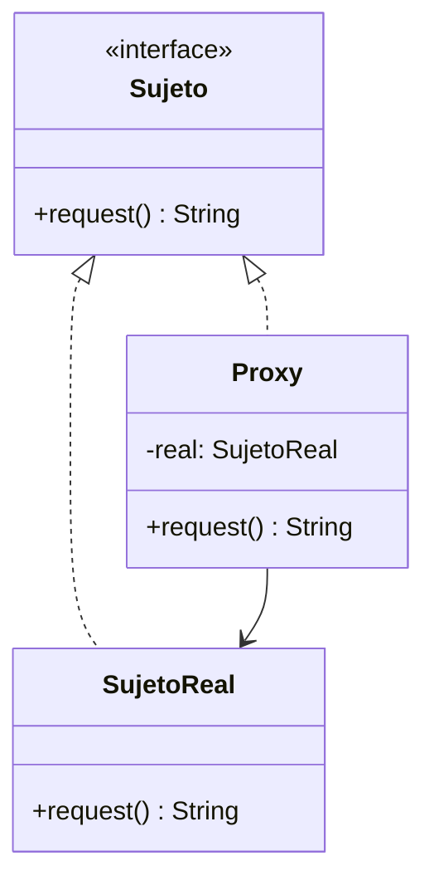

# Paso 12 — Proxy

¡Hola! 👋 Bienvenido al paso 12.

El patrón **Proxy** introduce un sustituto que controla el acceso a un objeto real. Ese intermediario puede añadir validación, cache, carga diferida, control remoto o métricas sin cambiar la interfaz usada por el cliente.

La idea central es que tanto el objeto real como el proxy implementan el mismo contrato. Así el cliente puede usar cualquiera de los dos de forma transparente.

En Kotlin suele verse como una interfaz `Subject` y una clase `Proxy` que guarda internamente al objeto real.

## Diagrama UML / estructura sugerida

```text
Cliente ──► Subject
     ▲   ▲
     │   │
  Proxy  RealSubject
     │
     └─ controla el acceso al objeto real
```



## El esqueleto actual 🧩

Abre el archivo `src/main/kotlin/patterns/structural/Proxy.kt`. Encontrarás algo parecido a esto:

```kotlin
package patterns.structural

class ServicioDocumentoReal {
    fun descargar(id: String): String = "Contenido del documento $id"
}

class ClienteDocumentosPendiente(
    private val servicioDocumentoReal: ServicioDocumentoReal
) {
    fun verDocumento(id: String): String {
        // TODO: inserta un proxy que controle el acceso.
        return servicioDocumentoReal.descargar(id)
    }
}
```

## Tu tarea ✅

1. Declara una interfaz `Subject` o `Sujeto` con la operación que el cliente necesita.
2. Haz que tanto el objeto real como `Proxy` implementen esa interfaz.
3. Agrega lógica extra en el proxy: autorización, cache, logging o carga diferida.
4. Demuestra que el cliente puede usar el proxy sin conocer los detalles del objeto real.

Luego haz commit y push a `main`:

```bash
git add .
git commit -m "paso-12: implemento proxy"
git push
```

<details>
<summary>💡 Pista</summary>

Si el cliente necesita saber cuándo usar proxy y cuándo usar el real, el patrón perdió parte de su valor. Ambos deben compartir el mismo contrato.

</details>
