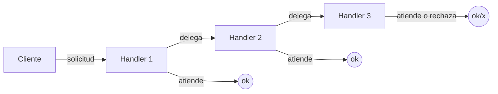

# Paso 13 — Cadena de responsabilidad

¡Hola! 👋 Bienvenido al paso 13.

La **Cadena de responsabilidad** permite pasar una solicitud a través de una serie de manejadores hasta que alguno la procese. Cada eslabón decide si atiende la petición o la delega al siguiente.

Esto reduce el acoplamiento entre quien emite la solicitud y quien finalmente la resuelve. También facilita reordenar, añadir o quitar reglas sin reescribir un gran bloque `if/else`.

En Kotlin suele modelarse con una clase base que conoce a `next` y una operación `handle(...)`.

## Diagrama UML / estructura sugerida

```text
Cliente ──► Handler1 ──► Handler2 ──► Handler3
      │            │            │
      └ atiende    └ delega     └ atiende o rechaza
```



## El esqueleto actual 🧩

Abre el archivo `src/main/kotlin/patterns/behavioral/ChainOfResponsibility.kt`. Encontrarás algo parecido a esto:

```kotlin
package patterns.behavioral

data class SolicitudSoporte(
    val nivel: Int,
    val mensaje: String
)

open class MesaAyudaPendiente {
    var siguientePendiente: MesaAyudaPendiente? = null

    fun enlazar(siguiente: MesaAyudaPendiente): MesaAyudaPendiente {
        siguientePendiente = siguiente
        return siguiente
    }

    open fun atenderPendiente(solicitud: SolicitudSoporte): String {
        return siguientePendiente?.atenderPendiente(solicitud)
            ?: "Sin responsable para: ${solicitud.mensaje}"
    }
}
```

## Tu tarea ✅

1. Declara una clase base o interfaz con `handle(...)` y una referencia `next` al siguiente manejador.
2. Implementa al menos dos manejadores concretos con reglas distintas.
3. Haz que cada manejador delegue cuando no pueda procesar la solicitud.
4. Demuestra la cadena completa con varias entradas de ejemplo.

Luego haz commit y push a `main`:

```bash
git add .
git commit -m "paso-13: implemento cadena de responsabilidad"
git push
```

<details>
<summary>💡 Pista</summary>

Una forma simple es que `handle` devuelva `String?`: si no puede resolver, llama a `next?.handle(...)`.

</details>
