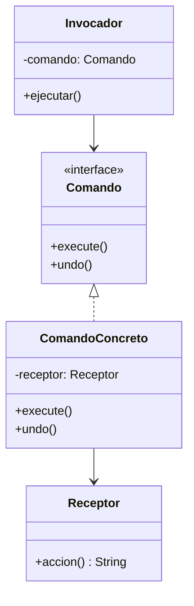

# Paso 14 — Comando

¡Hola! 👋 Bienvenido al paso 14.

El patrón **Command** encapsula una petición como un objeto. Eso permite parametrizar acciones, hacer colas, deshacer operaciones, registrar historial o desacoplar el invocador del receptor real.

El invocador no necesita saber cómo se ejecuta la acción. Solo conoce que existe un objeto comando con una operación común.

En Kotlin este patrón aparece mucho en botones, menús, automatizaciones y sistemas de tareas.

## Diagrama UML / estructura sugerida

```text
Invoker ──► Command
     ▲
     │
      ConcreteCommand ──► Receiver
```



## El esqueleto actual 🧩

Abre el archivo `src/main/kotlin/patterns/behavioral/Command.kt`. Encontrarás algo parecido a esto:

```kotlin
package patterns.behavioral

class Luz {
    fun encender(): String = "Luz encendida"
    fun apagar(): String = "Luz apagada"
}

class BotonComandoPendiente(
    private val accion: () -> String
) {
    fun presionar(): String = accion()
}

fun demoTemporal(): String {
    val luz = Luz()
    // TODO: reemplaza esta lambda por objetos comando.
    val boton = BotonComandoPendiente { luz.encender() }
    return boton.presionar()
}
```

## Tu tarea ✅

1. Declara una interfaz `Command` o `Comando` con `fun execute()`.
2. Crea al menos un receptor real y dos comandos concretos que lo usen.
3. Haz que el invocador almacene y ejecute comandos sin conocer la lógica interna.
4. Si quieres ir un paso más allá, agrega historial o deshacer.

Luego haz commit y push a `main`:

```bash
git add .
git commit -m "paso-14: implemento comando"
git push
```

<details>
<summary>💡 Pista</summary>

El invocador debería depender del comando, no del receptor. Piensa en un `Boton` que solo sabe llamar `execute()`.

</details>
