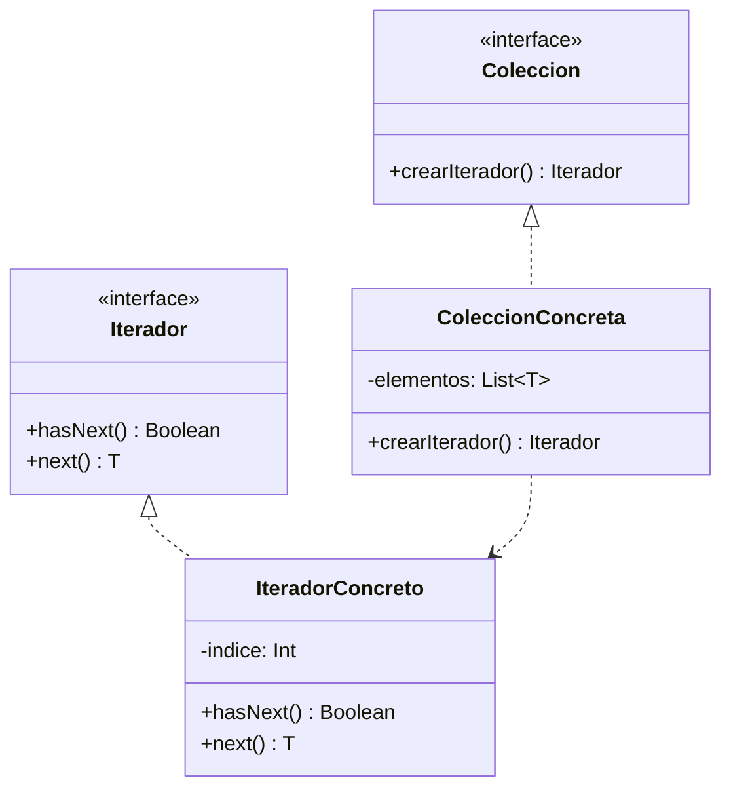

# Paso 15 — Iterador

¡Hola! 👋 Bienvenido al paso 15.

El patrón **Iterator** proporciona una forma de recorrer una colección sin exponer su representación interna. El cliente solo conoce operaciones para avanzar y consultar el siguiente elemento.

Aunque Kotlin ya trae iteradores en la biblioteca estándar, implementar el patrón a mano ayuda a entender cómo encapsular recorridos personalizados.

La versión clásica define operaciones como `hasNext()` y `next()` sobre una estructura agregada.

## Diagrama UML / estructura sugerida

```text
Aggregate ──► createIterator()
          │
          ▼
       Iterator
     ├─ hasNext()
     └─ next()
```



## El esqueleto actual 🧩

Abre el archivo `src/main/kotlin/patterns/behavioral/Iterator.kt`. Encontrarás algo parecido a esto:

```kotlin
package patterns.behavioral

class PlaylistPendiente(
    private val canciones: List<String>
) {
    private var indiceActual: Int = 0

    fun tieneMasPendiente(): Boolean = indiceActual < canciones.size

    fun siguientePendiente(): String {
        val valor = canciones[indiceActual]
        indiceActual += 1
        return valor
    }
}
```

## Tu tarea ✅

1. Define una interfaz de iterador o una clase concreta con `hasNext()` y `next()`.
2. Haz que la colección cree o devuelva su iterador.
3. Recorre los elementos sin exponer directamente la estructura interna.
4. Incluye un ejemplo donde el cliente use solo el iterador para navegar.

Luego haz commit y push a `main`:

```bash
git add .
git commit -m "paso-15: implemento iterador"
git push
```

<details>
<summary>💡 Pista</summary>

Puedes apoyarte en una lista interna, pero el cliente no debería manipular el índice directamente.

</details>
