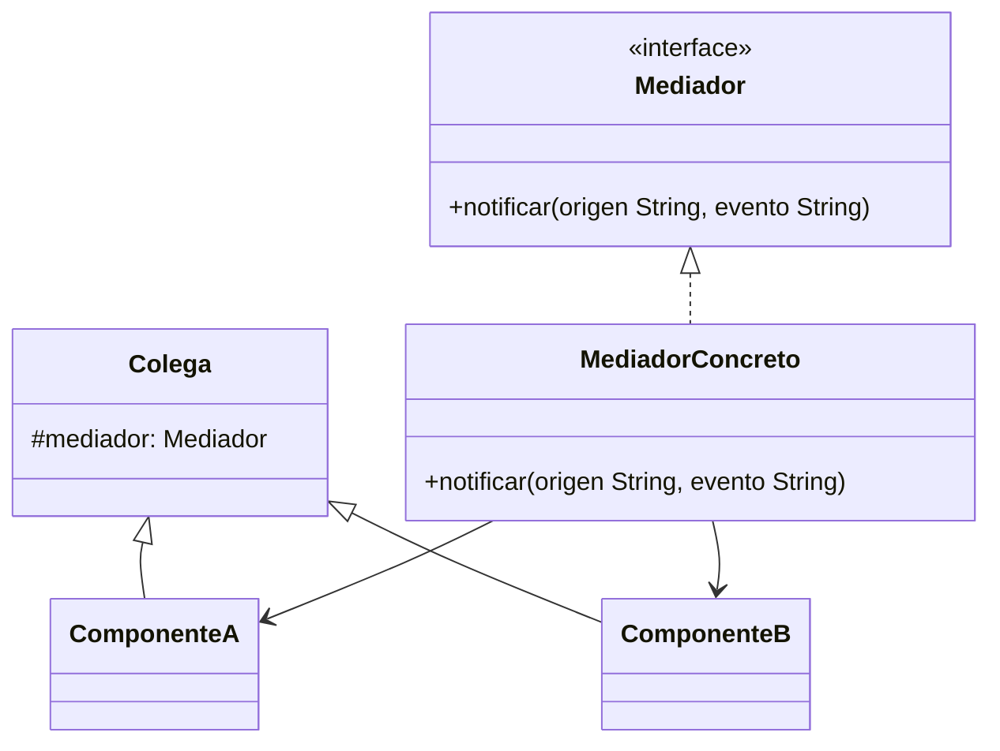

# Paso 16 — Mediador

¡Hola! 👋 Bienvenido al paso 16.

El patrón **Mediator** centraliza la comunicación entre varios objetos para que no se conozcan directamente entre sí. Así disminuye la cantidad de dependencias cruzadas y el sistema se vuelve más mantenible.

Es muy común en interfaces gráficas, flujos de validación y coordinación entre componentes que reaccionan a eventos.

La clave es que cada colega reporta cambios al mediador y este decide a quién notificar o qué acciones disparar.

## Diagrama UML / estructura sugerida

```text
Colega A ─┐
Colega B ─┼──► Mediator ◄── Colega C
Colega D ─┘        │
           └─ coordina interacciones
```



## El esqueleto actual 🧩

Abre el archivo `src/main/kotlin/patterns/behavioral/Mediator.kt`. Encontrarás algo parecido a esto:

```kotlin
package patterns.behavioral

class CampoTextoPendiente(var valor: String = "")

class BotonPendiente(var habilitado: Boolean = false)

class FormularioRegistroPendiente {
    val nombre = CampoTextoPendiente()
    val correo = CampoTextoPendiente()
    val enviar = BotonPendiente()

    fun recalcularEstado() {
        // TODO: extrae esta coordinación a un mediador.
        enviar.habilitado = nombre.valor.isNotBlank() && correo.valor.contains("@")
    }
}
```

## Tu tarea ✅

1. Declara una interfaz `Mediator` o `Mediador` con un método `notify(...)` o `notificar(...)`.
2. Crea al menos dos colegas que deleguen sus eventos al mediador.
3. Mueve la lógica de coordinación fuera de los colegas y llévala al mediador concreto.
4. Demuestra un flujo donde un cambio en un colega afecte a otro.

Luego haz commit y push a `main`:

```bash
git add .
git commit -m "paso-16: implemento mediador"
git push
```

<details>
<summary>💡 Pista</summary>

Si tus colegas se siguen llamando unos a otros directamente, todavía no terminaste. Todos deberían hablar con el mediador.

</details>
