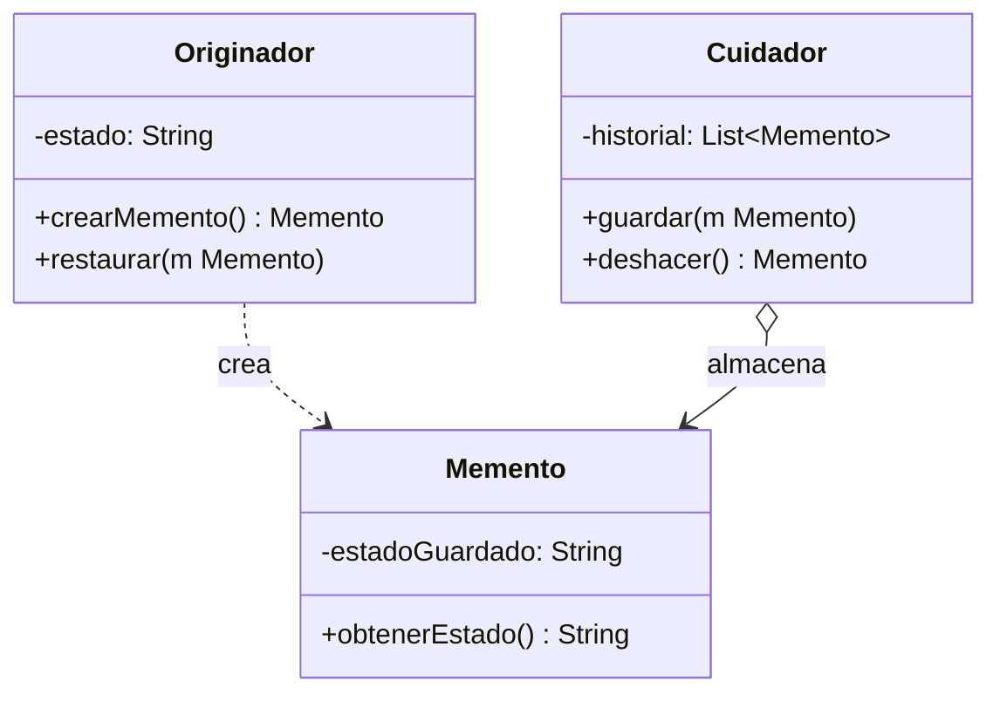

# Paso 17 — Recuerdo

¡Hola! 👋 Bienvenido al paso 17.

El patrón **Memento** captura y externaliza el estado interno de un objeto sin violar su encapsulamiento. Luego ese estado puede restaurarse más tarde para implementar deshacer, versiones o checkpoints.

La estructura típica involucra tres roles: el originador que crea y restaura mementos, el memento que guarda la instantánea y el cuidador que administra el historial.

En Kotlin es común representarlo con una pequeña clase de datos para el estado guardado.

## Diagrama UML / estructura sugerida

```text
Originator ──► createMemento() ──► Memento
     ▲                               │
     └──── restore(memento) ◄────────┘

Caretaker guarda el historial
```



## El esqueleto actual 🧩

Abre el archivo `src/main/kotlin/patterns/behavioral/Memento.kt`. Encontrarás algo parecido a esto:

```kotlin
package patterns.behavioral

data class EditorPendiente(
    var titulo: String,
    var contenido: String
)

class HistorialBasico {
    private val snapshots = mutableListOf<Pair<String, String>>()

    fun registrar(editor: EditorPendiente) {
        snapshots += editor.titulo to editor.contenido
    }

    fun ultimo(): Pair<String, String>? = snapshots.lastOrNull()
}

// TODO: transforma esta solución en una implementación formal del patrón Memento.
```

## Tu tarea ✅

1. Crea una clase `Memento` que represente la instantánea del estado.
2. Haz que el originador pueda `save(...)` / `guardar(...)` y restaurar desde un memento.
3. Agrega un cuidador o historial que almacene varias instantáneas.
4. Demuestra un flujo de edición con guardar y deshacer.

Luego haz commit y push a `main`:

```bash
git add .
git commit -m "paso-17: implemento recuerdo"
git push
```

<details>
<summary>💡 Pista</summary>

El cuidador administra la lista de mementos, pero no debería manipular internamente el estado del originador.

</details>
