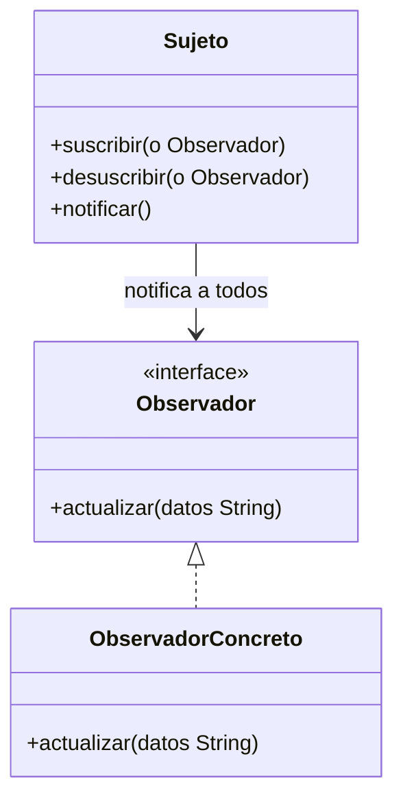

# Paso 18 — Observador

¡Hola! 👋 Bienvenido al paso 18.

El patrón **Observer** establece una relación uno-a-muchos entre un sujeto y sus observadores. Cuando el sujeto cambia, notifica automáticamente a todos los suscriptores.

Es un patrón esencial para eventos, sistemas reactivos, interfaces gráficas y cualquier caso donde varios componentes deban reaccionar a cambios sin acoplarse entre sí.

Aunque hoy existen flujos y streams más sofisticados, entender Observer ayuda a reconocer la base conceptual de muchas APIs reactivas.

## Diagrama UML / estructura sugerida

```text
Subject
  ├─ attach(observer)
  ├─ detach(observer)
  └─ notifyObservers()
│
▼
     Observer.update(...)
```



## El esqueleto actual 🧩

Abre el archivo `src/main/kotlin/patterns/behavioral/Observer.kt`. Encontrarás algo parecido a esto:

```kotlin
package patterns.behavioral

class EstacionClimaPendiente {
    private val suscriptores = mutableListOf<(Int) -> Unit>()
    private var temperaturaActual: Int = 0

    fun suscribirse(observer: (Int) -> Unit) {
        suscriptores += observer
    }

    fun cambiarTemperatura(nuevaTemperatura: Int) {
        temperaturaActual = nuevaTemperatura
        suscriptores.forEach { it(temperaturaActual) }
    }
}

// TODO: reemplaza las lambdas por una implementación explícita del patrón Observer.
```

## Tu tarea ✅

1. Declara una interfaz `Observer` o `Observador` con `update(...)` o `actualizar(...)`.
2. Modela un sujeto que registre y notifique observadores.
3. Crea al menos dos observadores concretos con reacciones distintas.
4. Demuestra una actualización propagada automáticamente a todos los suscriptores.

Luego haz commit y push a `main`:

```bash
git add .
git commit -m "paso-18: implemento observador"
git push
```

<details>
<summary>💡 Pista</summary>

Puedes empezar con un sujeto que mantiene `mutableListOf<Observer>()` y recorrerla al notificar.

</details>
