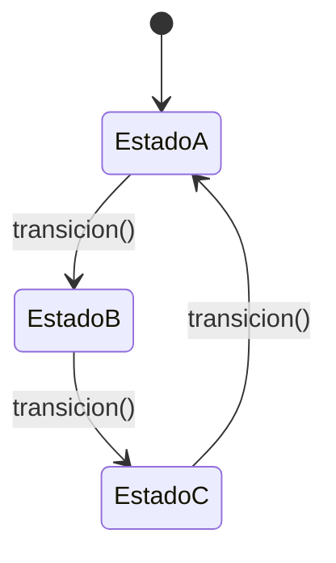

# Paso 19 — Estado

¡Hola! 👋 Bienvenido al paso 19.

El patrón **State** permite que un objeto cambie su comportamiento cuando cambia su estado interno. Desde afuera parece que cambiara de clase, pero en realidad delega en objetos de estado.

Es la alternativa elegante a un gran `when` o `if/else` que decide comportamiento según una variable de estado. Cada estado concreto encapsula la lógica correspondiente.

El contexto mantiene una referencia al estado actual y delega en él operaciones como `handle(...)`.

## Diagrama UML / estructura sugerida

```text
Context ──► State.handle(context)
    ▲        ▲
    │        │
      EstadoA   EstadoB
```



## El esqueleto actual 🧩

Abre el archivo `src/main/kotlin/patterns/behavioral/State.kt`. Encontrarás algo parecido a esto:

```kotlin
package patterns.behavioral

class SemaforoPendiente {
    private var modo: String = "ROJO"

    fun avanzar(): String {
        modo = when (modo) {
            "ROJO" -> "VERDE"
            "VERDE" -> "AMARILLO"
            else -> "ROJO"
        }
        return modo
    }
}

// TODO: reemplaza el when por estados concretos.
```

## Tu tarea ✅

1. Declara una interfaz `State` o `Estado` con un método `handle(...)` o `manejar(...)`.
2. Crea un contexto que mantenga el estado actual y permita cambiarlo.
3. Implementa al menos dos estados concretos con comportamientos distintos.
4. Demuestra una transición de estado durante la ejecución.

Luego haz commit y push a `main`:

```bash
git add .
git commit -m "paso-19: implemento estado"
git push
```

<details>
<summary>💡 Pista</summary>

Haz que cada estado decida cuál será el siguiente cuando corresponda. Así el contexto queda más limpio.

</details>
