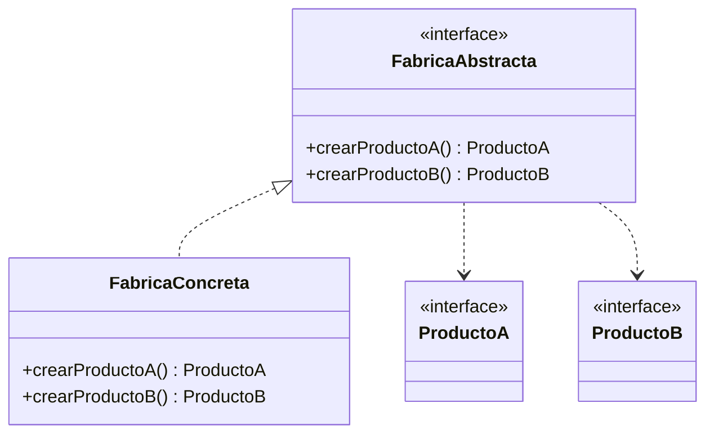

# Paso 2 — Fábrica abstracta

¡Hola! 👋 Bienvenido al paso 2.

La **Fábrica abstracta** crea familias completas de objetos relacionados sin especificar sus clases concretas. En lugar de una sola operación de creación, tienes varias operaciones coordinadas que garantizan compatibilidad entre productos.

Este patrón es ideal cuando una aplicación necesita cambiar de tema, plataforma o proveedor y todos los objetos creados deben pertenecer a la misma familia. El cliente solo conoce la fábrica abstracta y las interfaces de productos.

En Kotlin puedes modelarlo con una interfaz `AbstractFactory` y varias interfaces de producto; luego cada fábrica concreta devuelve variantes compatibles entre sí.

## Diagrama UML / estructura sugerida

```text
AbstractFactory
  ├─ createProductA(): ProductA
  └─ createProductB(): ProductB
       ▲
       │
FabricaConcreta ──► ProductoAConcreto / ProductoBConcreto

Cliente ──► AbstractFactory ──► familia de productos compatibles
```



## El esqueleto actual 🧩

Abre el archivo `src/main/kotlin/patterns/creational/AbstractFactory.kt`. Encontrarás algo parecido a esto:

```kotlin
package patterns.creational

interface MotorPendiente {
    fun tipo(): String
}

interface PanelPendiente {
    fun tema(): String
}

class CatalogoPendiente {
    fun describirConfiguracion(): String {
        // TODO: aquí debería usarse una fábrica abstracta real.
        val motor = object : MotorPendiente {
            override fun tipo(): String = "motor temporal"
        }
        val panel = object : PanelPendiente {
            override fun tema(): String = "tema temporal"
        }
        return "Configuración: ${motor.tipo()} + ${panel.tema()}"
    }
}
```

## Tu tarea ✅

1. Declara una interfaz `AbstractFactory` (o `FabricaAbstracta`) que cree al menos dos productos relacionados.
2. Crea interfaces de producto para ambas familias y luego implementaciones concretas compatibles entre sí.
3. Haz que el cliente reciba una fábrica por parámetro para que pueda cambiar de familia sin modificar su lógica.
4. Demuestra el patrón construyendo dos variantes, por ejemplo una familia web y otra móvil, o una ligera y otra premium.

Luego haz commit y push a `main`:

```bash
git add .
git commit -m "paso-2: implemento fabrica abstracta"
git push
```

<details>
<summary>💡 Pista</summary>

Si ves que el cliente necesita hacer `if` para saber qué producto usar, todavía no terminaste. La gracia está en que **la fábrica entregue un conjunto coherente** de objetos relacionados.

</details>
