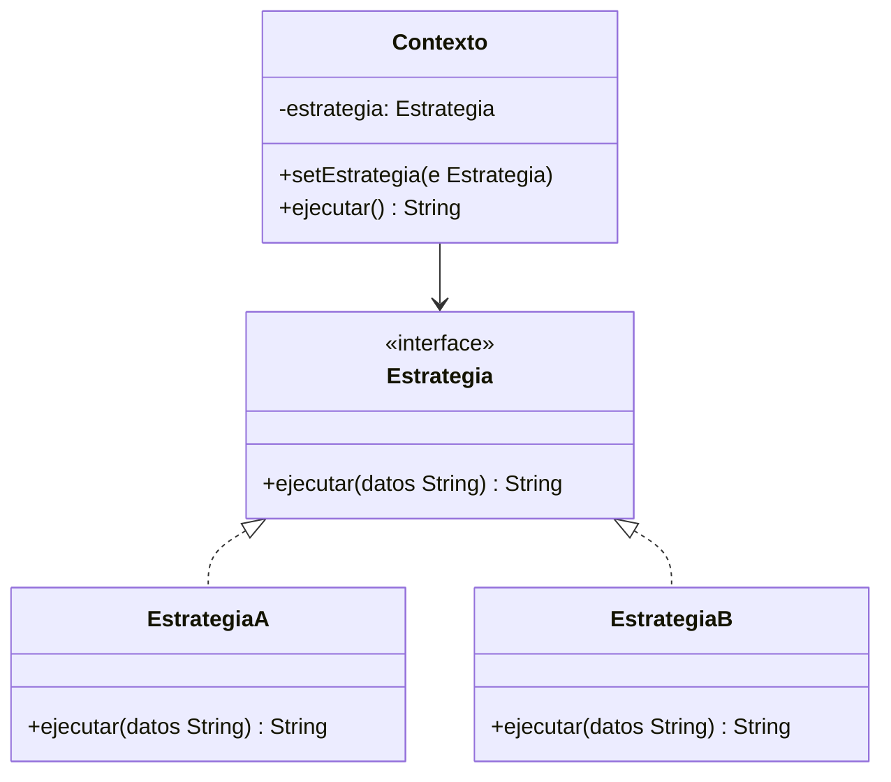

# Paso 20 — Estrategia

¡Hola! 👋 Bienvenido al paso 20.

El patrón **Strategy** encapsula algoritmos intercambiables detrás de una misma interfaz. El contexto delega en la estrategia seleccionada sin conocer los detalles de cada algoritmo.

Se usa cuando tienes varias formas de resolver una misma tarea: ordenar, comprimir, calcular precios, autenticar o enviar notificaciones.

En Kotlin puede implementarse con interfaces clásicas o incluso con funciones, pero la versión con `Strategy` explícita ayuda a visualizar mejor el patrón.

## Diagrama UML / estructura sugerida

```text
Context ──► Strategy.execute(...)
     ▲          ▲
     │          │
EstrategiaA  EstrategiaB
```



## El esqueleto actual 🧩

Abre el archivo `src/main/kotlin/patterns/behavioral/Strategy.kt`. Encontrarás algo parecido a esto:

```kotlin
package patterns.behavioral

class CalculadoraEnvioPendiente {
    fun calcular(tipo: String, peso: Double): Double {
        return when (tipo) {
            "normal" -> peso * 5
            "express" -> peso * 8
            else -> peso * 12
        }
    }
}

// TODO: extrae este comportamiento a estrategias intercambiables.
```

## Tu tarea ✅

1. Declara una interfaz `Strategy` o `Estrategia` con `execute(...)` o `ejecutar(...)`.
2. Crea al menos dos estrategias concretas con algoritmos distintos.
3. Haz que el contexto reciba la estrategia por constructor o setter.
4. Demuestra que puedes cambiar la estrategia sin modificar el contexto.

Luego haz commit y push a `main`:

```bash
git add .
git commit -m "paso-20: implemento estrategia"
git push
```

<details>
<summary>💡 Pista</summary>

Si tu contexto sigue usando `when(tipoDeEstrategia)`, todavía no aprovechaste el patrón. Deja que el polimorfismo haga el trabajo.

</details>
