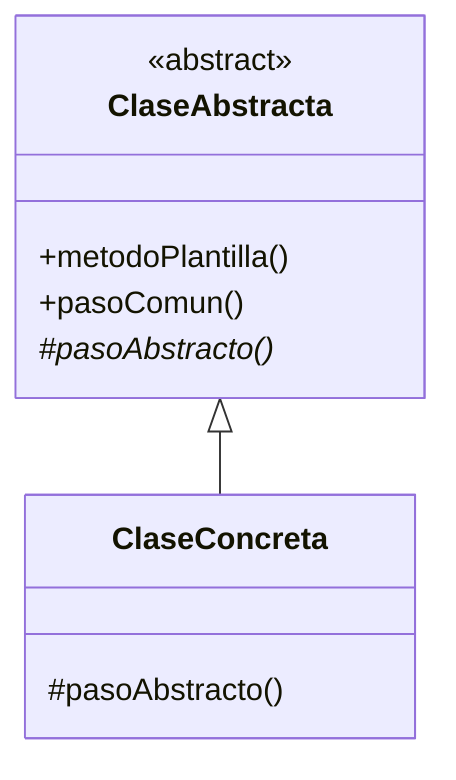

# Paso 21 — Método plantilla

¡Hola! 👋 Bienvenido al paso 21.

El patrón **Template Method** define el esqueleto de un algoritmo en una clase base y deja que las subclases implementen ciertos pasos. Así preservas el flujo general mientras permites variaciones controladas.

Es muy útil cuando varios procesos comparten la misma secuencia general, pero difieren en detalles específicos. Evita duplicación y mantiene coherencia en el orden de ejecución.

La pieza central es un método plantilla que llama a operaciones abstractas u opcionales (`hooks`).

## Diagrama UML / estructura sugerida

```text
AbstractClass
  ├─ templateMethod()
  ├─ pasoComun()
  └─ pasoAbstracto()
▲
│
   ConcreteClass
```



## El esqueleto actual 🧩

Abre el archivo `src/main/kotlin/patterns/behavioral/TemplateMethod.kt`. Encontrarás algo parecido a esto:

```kotlin
package patterns.behavioral

class ExportadorCsvPendiente {
    fun exportar(datos: List<String>): String {
        val limpio = datos.joinToString(separator = "
")
        return "CSV:
$limpio"
    }
}

// TODO: generaliza este flujo con una clase abstracta y un método plantilla.
```

## Tu tarea ✅

1. Crea una `abstract class` con un método plantilla como `templateMethod()` o `metodoPlantilla()`.
2. Declara operaciones abstractas que deban implementar las subclases.
3. Agrega al menos dos subclases con pasos específicos distintos.
4. Demuestra que ambas recorren el mismo flujo general pero con diferencias controladas.

Luego haz commit y push a `main`:

```bash
git add .
git commit -m "paso-21: implemento metodo plantilla"
git push
```

<details>
<summary>💡 Pista</summary>

El método plantilla normalmente **no** debería ser sobreescrito. Lo importante es que las subclases solo personalicen los pasos previstos.

</details>
