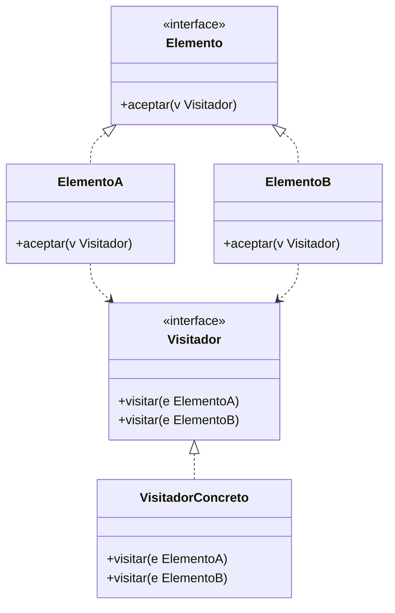

# Paso 22 — Visitante

¡Hola! 👋 Bienvenido al paso 22.

El patrón **Visitor** separa un conjunto de operaciones de la estructura de objetos sobre la que actúan. Permite añadir nuevos comportamientos sin modificar las clases de los elementos.

Es especialmente útil cuando tienes una jerarquía estable de elementos y necesitas incorporar operaciones transversales como exportación, validación o métricas.

La técnica clave es el doble despacho: cada elemento acepta un visitante y el visitante tiene un método específico para cada tipo concreto.

## Diagrama UML / estructura sugerida

```text
Visitor
  ├─ visit(ElementA)
  └─ visit(ElementB)

Element ──► accept(visitor)
     ▲             │
     └─────────────┘ doble despacho
```



## El esqueleto actual 🧩

Abre el archivo `src/main/kotlin/patterns/behavioral/Visitor.kt`. Encontrarás algo parecido a esto:

```kotlin
package patterns.behavioral

interface FiguraPendiente {
    fun descripcion(): String
}

data class CirculoPendiente(val radio: Double) : FiguraPendiente {
    override fun descripcion(): String = "Círculo de radio $radio"
}

data class RectanguloPendiente(val ancho: Double, val alto: Double) : FiguraPendiente {
    override fun descripcion(): String = "Rectángulo ${ancho}x$alto"
}

fun imprimirFiguras(figuras: List<FiguraPendiente>): String {
    // TODO: reemplaza este recorrido ad-hoc por un visitante.
    return figuras.joinToString(separator = "
") { it.descripcion() }
}
```

## Tu tarea ✅

1. Declara una interfaz `Visitor` o `Visitante` con métodos `visit(...)` o `visitar(...)` para cada elemento concreto.
2. Haz que cada elemento implemente `accept(...)` y delegue al visitante correcto.
3. Crea al menos un visitante concreto con una operación útil sobre la estructura.
4. Demuestra el doble despacho recorriendo varios elementos.

Luego haz commit y push a `main`:

```bash
git add .
git commit -m "paso-22: implemento visitante"
git push
```

<details>
<summary>💡 Pista</summary>

La pista más importante es el método `accept(visitor)`: dentro de él no hagas `when`; simplemente llama al método específico del visitante para ese tipo.

</details>
