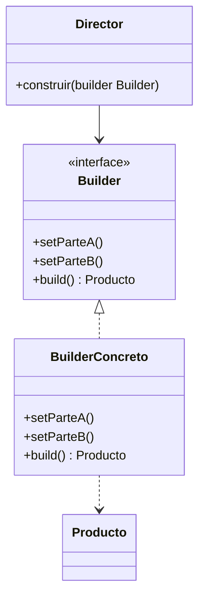

# Paso 3 — Constructor

¡Hola! 👋 Bienvenido al paso 3.

El patrón **Builder** separa la construcción de un objeto complejo de su representación final. Permite crear un objeto paso a paso sin necesidad de exponer un constructor gigantesco ni una secuencia caótica de setters.

Es especialmente útil cuando el objeto tiene partes opcionales, validaciones o combinaciones de configuración. También facilita tener distintos directores o recetas de construcción sobre el mismo builder.

En Kotlin este patrón convive muy bien con clases de datos, DSLs y funciones con receptor, pero primero conviene entender la versión clásica con un `Builder` explícito y un método `build()`.

## Diagrama UML / estructura sugerida

```text
Director ──► Builder
      ├─ setParteA()
      ├─ setParteB()
      └─ build(): Producto
               │
               ▼
            Producto
```



## El esqueleto actual 🧩

Abre el archivo `src/main/kotlin/patterns/creational/Builder.kt`. Encontrarás algo parecido a esto:

```kotlin
package patterns.creational

data class Computadora(
    val cpu: String,
    val memoriaGb: Int,
    val almacenamientoGb: Int,
    val gpu: String?
)

class ConfiguracionPendiente {
    var cpu: String = "pendiente"
    var memoriaGb: Int = 0
    var almacenamientoGb: Int = 0
    var gpu: String? = null

    // TODO: reemplaza esta clase por un Builder real con métodos encadenables.
    fun crearTemporal(): Computadora {
        return Computadora(cpu, memoriaGb, almacenamientoGb, gpu)
    }
}
```

## Tu tarea ✅

1. Crea una clase `Builder` (o `Constructor`) que acumule el estado necesario para armar el objeto final.
2. Implementa un método `build()` que valide y devuelva el producto terminado.
3. Agrega métodos encadenables para configurar al menos tres partes del objeto.
4. Incluye un ejemplo de uso que construya dos variantes distintas del mismo producto.

Luego haz commit y push a `main`:

```bash
git add .
git commit -m "paso-3: implemento constructor"
git push
```

<details>
<summary>💡 Pista</summary>

Un buen builder deja claro **qué partes son obligatorias** y cuáles son opcionales. Si quieres, puedes lanzar `IllegalStateException` en `build()` cuando falte información clave.

</details>
