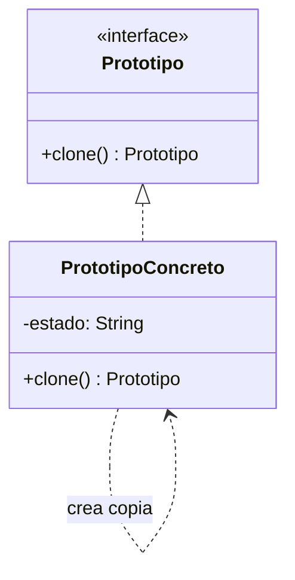

# Paso 4 — Prototipo

¡Hola! 👋 Bienvenido al paso 4.

El patrón **Prototype** crea nuevos objetos clonando una instancia existente. En vez de construir desde cero, partes de un prototipo configurado previamente y lo duplicas con cambios mínimos.

Esto resulta útil cuando la construcción es costosa, cuando existen muchas combinaciones de configuración o cuando necesitas copiar objetos complejos sin acoplarte a sus clases concretas.

Kotlin ya ofrece `copy()` para `data class`, pero el patrón sigue siendo relevante para razonar sobre clonación, copia profunda y contratos explícitos como `Prototype` o `Clonable`.

## Diagrama UML / estructura sugerida

```text
Prototype
  └─ clone(): Prototype
       ▲
       │
PrototipoConcreto ──► copia ajustada

Cliente ──► prototipo existente ──► clon
```



## El esqueleto actual 🧩

Abre el archivo `src/main/kotlin/patterns/creational/Prototype.kt`. Encontrarás algo parecido a esto:

```kotlin
package patterns.creational

data class DocumentoBase(
    val titulo: String,
    val cuerpo: String,
    val etiquetas: List<String>
)

interface BorradorPendiente {
    fun duplicarBorrador(): DocumentoBase
}

class PrototipoDocumentoPendiente(
    private val base: DocumentoBase
) : BorradorPendiente {
    override fun duplicarBorrador(): DocumentoBase {
        // TODO: reemplaza esta solución temporal por una interfaz Prototype real.
        return base.copy()
    }
}
```

## Tu tarea ✅

1. Declara una interfaz `Prototype` (o `Prototipo`) con una operación de clonación.
2. Implementa `clone()` o usa `copy()` de manera explícita para duplicar el estado relevante.
3. Demuestra al menos una copia modificada a partir de un prototipo base.
4. Asegúrate de que el ejemplo deje claro si estás haciendo copia superficial o profunda.

Luego haz commit y push a `main`:

```bash
git add .
git commit -m "paso-4: implemento prototipo"
git push
```

<details>
<summary>💡 Pista</summary>

Si eliges `data class`, puedes apoyarte en `copy()`, pero explica con nombres y comentarios qué partes del objeto se duplican de verdad y cuáles se comparten.

</details>
