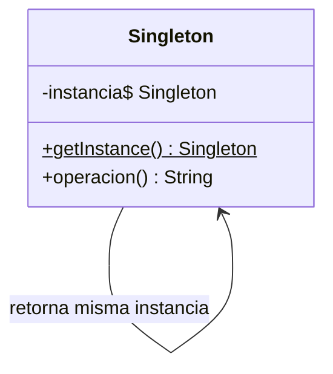

# Paso 5 — Instancia única

¡Hola! 👋 Bienvenido al paso 5.

El patrón **Singleton** garantiza que exista una sola instancia de una clase y ofrece un punto global de acceso a ella. Se usa cuando un recurso compartido debe mantenerse coherente durante toda la ejecución.

Sin embargo, no todo recurso global debe convertirse en singleton: úsalo con criterio. El patrón es adecuado para configuraciones, caches pequeñas o coordinadores centrales cuando no estás usando inyección de dependencias.

Kotlin simplifica muchísimo este patrón con la palabra clave `object`, aunque también puedes lograrlo con una clase y `companion object`.

## Diagrama UML / estructura sugerida

```text
Singleton
  ├─ instancia única
  └─ operación compartida()

Cliente A ─┐
Cliente B ─┼──► misma instancia
Cliente C ─┘
```



## El esqueleto actual 🧩

Abre el archivo `src/main/kotlin/patterns/creational/Singleton.kt`. Encontrarás algo parecido a esto:

```kotlin
package patterns.creational

class RegistroConfiguracionPendiente {
    private var entorno: String = "dev"

    fun leerEntorno(): String = entorno

    fun cambiarEntorno(nuevoEntorno: String) {
        entorno = nuevoEntorno
    }
}

fun crearDosConfiguracionesTemporales(): Pair<RegistroConfiguracionPendiente, RegistroConfiguracionPendiente> {
    // TODO: reemplaza estas dos instancias por un singleton real.
    return RegistroConfiguracionPendiente() to RegistroConfiguracionPendiente()
}
```

## Tu tarea ✅

1. Convierte la solución temporal en un singleton usando `object` o `companion object`.
2. Agrega al menos un estado compartido y una operación que lo consulte o actualice.
3. Incluye un ejemplo breve que pruebe que todas las referencias apuntan a la misma instancia.
4. Documenta en el código por qué este caso sí merece una instancia única.

Luego haz commit y push a `main`:

```bash
git add .
git commit -m "paso-5: implemento instancia unica"
git push
```

<details>
<summary>💡 Pista</summary>

La versión más idiomática en Kotlin suele ser `object NombreDelSingleton`. Si prefieres una clase, entonces necesitarás un `companion object` que controle la creación.

</details>
