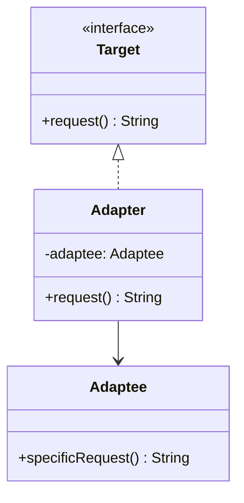

# Paso 6 — Adaptador

¡Hola! 👋 Bienvenido al paso 6.

El patrón **Adapter** convierte la interfaz de una clase existente en otra que el cliente espera. Es la herramienta clásica para integrar código legado, librerías externas o APIs incompatibles sin reescribirlas.

El cliente habla con una interfaz objetivo estable, mientras que el adaptador traduce las llamadas hacia el servicio existente. Así encapsulas la incompatibilidad en un punto controlado.

En Kotlin es común usar composición: el adaptador implementa `Target` y guarda una referencia a la clase adaptada.

## Diagrama UML / estructura sugerida

```text
Cliente ──► Target
     ▲
     │ implementa
  Adapter ───────► Adaptee
      traduce llamadas
```



## El esqueleto actual 🧩

Abre el archivo `src/main/kotlin/patterns/structural/Adapter.kt`. Encontrarás algo parecido a esto:

```kotlin
package patterns.structural

class ServicioPagoLegacy {
    fun procesarMontoEnCentavos(total: Int): String {
        return "Pago legacy por ${total} centavos"
    }
}

class ClienteCheckoutPendiente(
    private val servicioPagoLegacy: ServicioPagoLegacy
) {
    fun cobrar(totalEnPesos: Double): String {
        // TODO: el cliente no debería depender directamente de la API legacy.
        val centavos = (totalEnPesos * 100).toInt()
        return servicioPagoLegacy.procesarMontoEnCentavos(centavos)
    }
}
```

## Tu tarea ✅

1. Declara una interfaz `Target` (o `Objetivo`) con la operación que espera el cliente.
2. Crea un adaptador que implemente esa interfaz y que reciba por composición al servicio legado.
3. Haz la traducción necesaria entre nombres, tipos o formato de datos.
4. Actualiza el ejemplo para que el cliente trabaje solo contra `Target`.

Luego haz commit y push a `main`:

```bash
git add .
git commit -m "paso-6: implemento adaptador"
git push
```

<details>
<summary>💡 Pista</summary>

Tu adaptador debería **envolver** a la clase existente, no heredar de ella sin necesidad. Busca una combinación de `class ... : Target` + `private val adaptee`.

</details>
