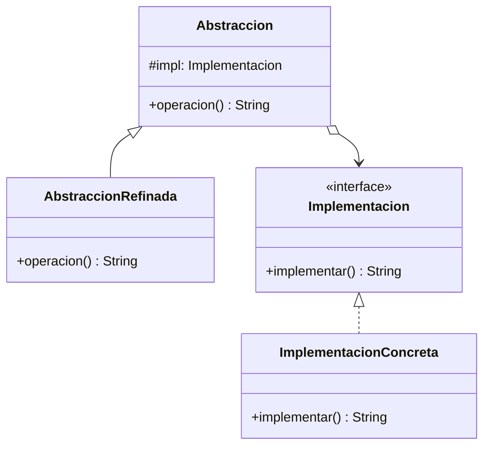

# Paso 7 — Puente

¡Hola! 👋 Bienvenido al paso 7.

El patrón **Bridge** separa una abstracción de su implementación para que ambas puedan variar de manera independiente. En vez de crear una explosión de subclases combinando todos los casos, conectas dos jerarquías mediante composición.

Esto es útil cuando tienes dos dimensiones de cambio. Por ejemplo: tipos de notificación y canales de envío; figuras y motores de render; controles remotos y dispositivos.

La abstracción mantiene una referencia a una implementación. En Kotlin, esa relación suele verse como un constructor que recibe una interfaz `Implementation`.

## Diagrama UML / estructura sugerida

```text
Abstraction ─────────► Implementation
      ▲                       ▲
      │                       │
RefinedAbstraction     ConcreteImplementation

   Dos jerarquías separadas conectadas por composición
```



## El esqueleto actual 🧩

Abre el archivo `src/main/kotlin/patterns/structural/Bridge.kt`. Encontrarás algo parecido a esto:

```kotlin
package patterns.structural

class ReportePendiente {
    fun exportarComoTexto(): String {
        // TODO: aquí debería existir una separación entre abstracción e implementación.
        return "Reporte temporal"
    }
}

class ReporteDetalladoPendiente {
    fun exportarDetallado(): String {
        return "Reporte detallado temporal"
    }
}
```

## Tu tarea ✅

1. Declara la interfaz `Implementation` (o `Implementacion`) con las operaciones de bajo nivel.
2. Crea una abstracción que reciba la implementación por constructor.
3. Agrega al menos dos implementaciones concretas y una abstracción refinada.
4. Muestra cómo combinar distintas abstracciones con distintas implementaciones sin crear nuevas subclases para cada mezcla.

Luego haz commit y push a `main`:

```bash
git add .
git commit -m "paso-7: implemento puente"
git push
```

<details>
<summary>💡 Pista</summary>

Si sientes que estás creando clases como `ReportePdfOscuro`, `ReportePdfClaro`, `ReporteHtmlOscuro`, probablemente Bridge es justo lo que necesitas evitar.

</details>
