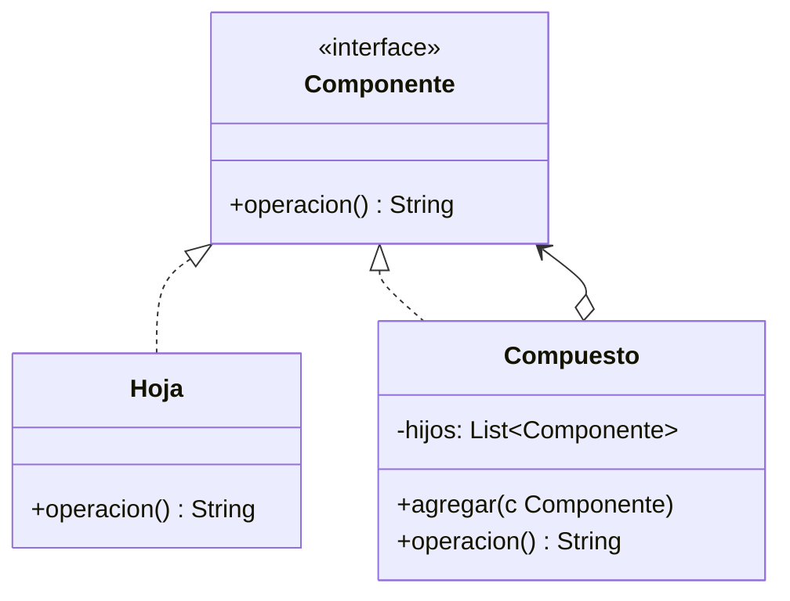

# Paso 8 — Objeto compuesto

¡Hola! 👋 Bienvenido al paso 8.

El patrón **Composite** permite tratar objetos individuales y composiciones de objetos de manera uniforme. La clave es que hojas y contenedores comparten una interfaz común.

Es ideal para árboles: archivos y carpetas, menús, componentes gráficos, estructuras organizacionales. El cliente interactúa con `Component` sin preocuparse por si está frente a una hoja o a un nodo compuesto.

En Kotlin suele implementarse con una interfaz base y una clase compuesta que mantiene una colección de hijos y ofrece operaciones como `add` o `remove`.

## Diagrama UML / estructura sugerida

```text
Component
  ├─ operation()
  └─ add()/remove() opcional
     ▲            ▲
     │            │
   Leaf      Composite ──► [Component, Component, ...]
```



## El esqueleto actual 🧩

Abre el archivo `src/main/kotlin/patterns/structural/Composite.kt`. Encontrarás algo parecido a esto:

```kotlin
package patterns.structural

interface NodoPendiente {
    fun renderizar(nivel: Int = 0): String
}

class ArchivoPendiente(
    private val nombre: String
) : NodoPendiente {
    override fun renderizar(nivel: Int): String = "${"  ".repeat(nivel)}- $nombre"
}

class CarpetaPendiente(
    private val nombre: String
) : NodoPendiente {
    override fun renderizar(nivel: Int): String {
        // TODO: convierte esta carpeta en un Composite real con hijos y add(...).
        return "${"  ".repeat(nivel)}+ $nombre"
    }
}
```

## Tu tarea ✅

1. Declara una interfaz `Component` (o `Componente`) para la operación común.
2. Implementa una hoja concreta y un compuesto que mantenga hijos.
3. Agrega una operación `add(...)` en el compuesto para construir el árbol.
4. Demuestra que el cliente puede recorrer y ejecutar la misma operación sobre hojas y compuestos.

Luego haz commit y push a `main`:

```bash
git add .
git commit -m "paso-8: implemento objeto compuesto"
git push
```

<details>
<summary>💡 Pista</summary>

No todos los componentes necesitan soportar `add`. Si usas una interfaz muy minimalista y dejas `add` solo en el compuesto, también es válido mientras el árbol quede claro.

</details>
