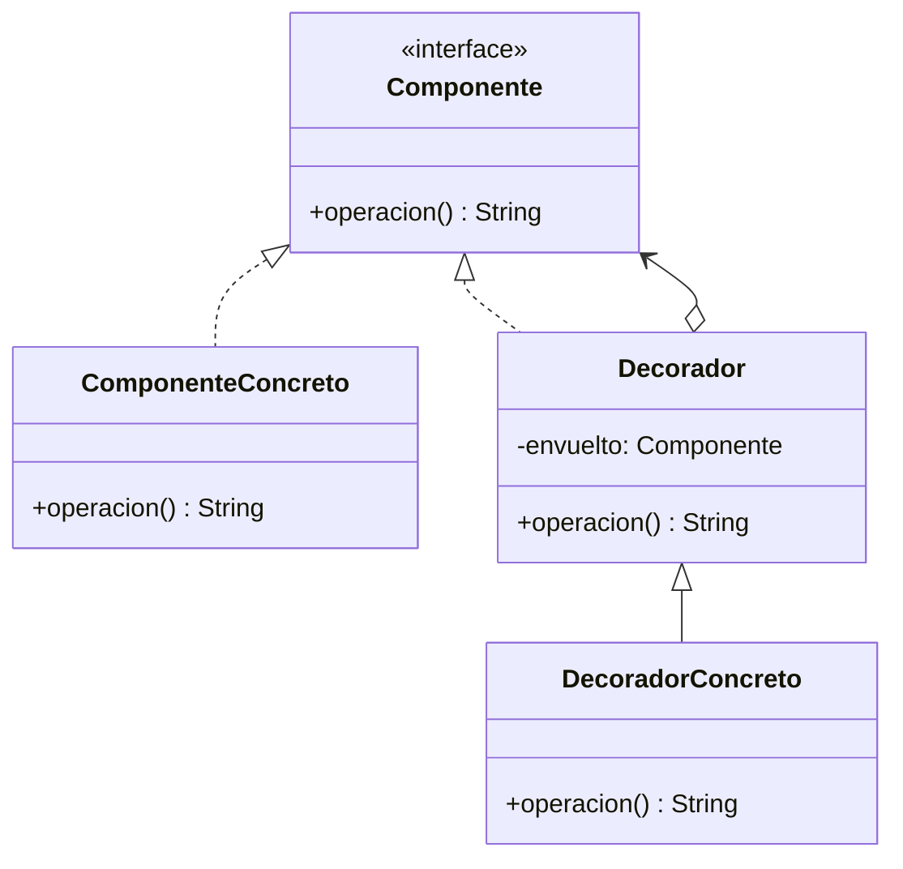

# Paso 9 — Decorador

¡Hola! 👋 Bienvenido al paso 9.

El patrón **Decorator** agrega responsabilidades a un objeto de manera dinámica sin modificar su clase. En vez de crear muchas subclases para cada combinación posible, envuelves componentes dentro de decoradores.

Cada decorador implementa la misma interfaz que el componente original y delega en él antes o después de añadir comportamiento. Esto produce composiciones flexibles y abiertas a extensión.

En Kotlin se modela muy bien con composición explícita: `class Leche(private val bebida: Component) : Component`.

## Diagrama UML / estructura sugerida

```text
Component ◄──────────── Decorator
      ▲                       │
      │                       └─ envuelve a otro Component
ConcreteComponent             ▲
                      │
               ConcreteDecorator
```



## El esqueleto actual 🧩

Abre el archivo `src/main/kotlin/patterns/structural/Decorator.kt`. Encontrarás algo parecido a esto:

```kotlin
package patterns.structural

interface BebidaPendiente {
    fun descripcionBase(): String
    fun costoBase(): Int
}

class CafeSimplePendiente : BebidaPendiente {
    override fun descripcionBase(): String = "Café simple"
    override fun costoBase(): Int = 25
}

class MenuPendiente {
    fun pedidoDelDia(): String {
        // TODO: sustituye este enfoque por decoradores encadenables.
        val bebida = CafeSimplePendiente()
        return "${bebida.descripcionBase()} -> $${bebida.costoBase()}"
    }
}
```

## Tu tarea ✅

1. Declara una interfaz `Component` (o `Componente`) con la operación principal.
2. Implementa un componente base y luego un decorador que reciba otro componente por constructor.
3. Añade al menos dos decoradores concretos que modifiquen el resultado.
4. Muestra una composición de decoradores encadenados.

Luego haz commit y push a `main`:

```bash
git add .
git commit -m "paso-9: implemento decorador"
git push
```

<details>
<summary>💡 Pista</summary>

El decorador debe **verse como** el componente y **contener** al componente. Si tu clase no recibe un componente por constructor, revisa el diseño.

</details>
